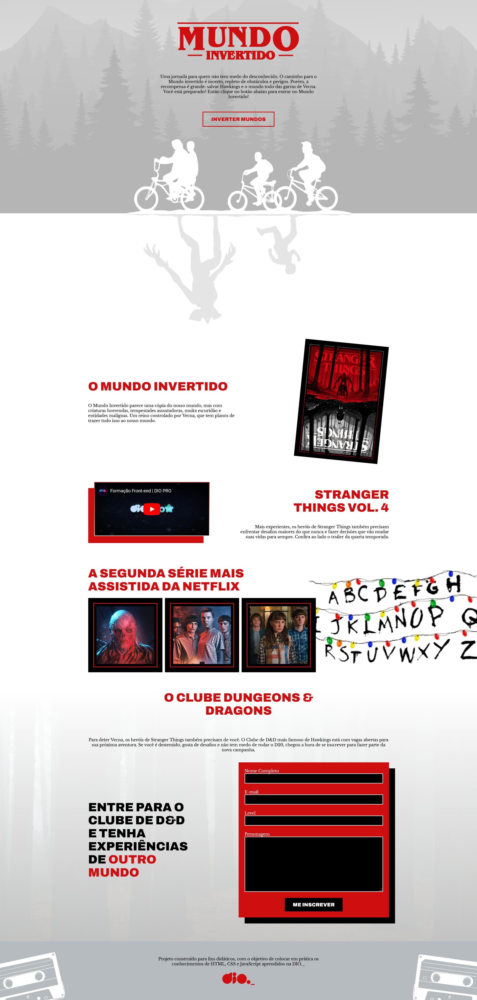
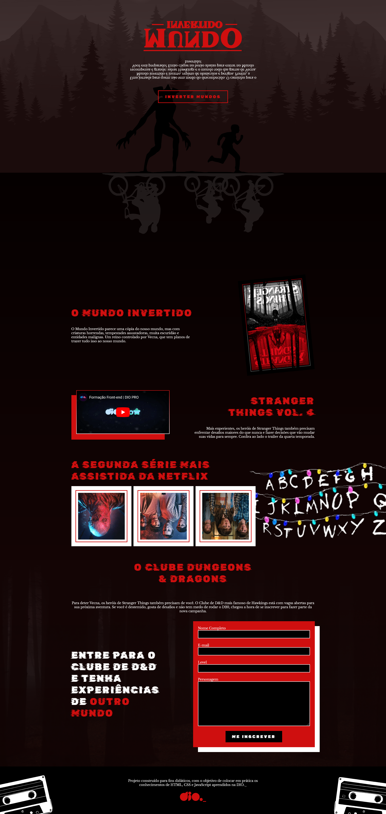

<p align="center">
    
</p>

# 🌌 Semana Front-end Mundo Invertido

Uma jornada para quem não tem medo do desconhecido. O caminho para o Mundo Invertido é incerto, repleto de obstáculos e perigos. Porém, a recompensa é grande: salvar Hawkings e o mundo todo das garras de Vecna. Você está preparado(a)? 

---

## 🛠️ Sobre o projeto

Este projeto foi clonado a partir do repositório base da **Semana Front-end Mundo Invertido** e desenvolvido durante as aulas do BootCamp **Rihappy** em parceria com a **DIO**. Além de implementar o conteúdo abordado, realizei melhorias pessoais, como:

- 🔧 Separação do código JavaScript em arquivos próprios para maior organização.
- ✨ Ajustes no design e na estrutura do código, otimizando a experiência do usuário.
- 🤳 Prints do resultado final.

---

## ▶️ Semana Front-end
- [📺 Live Dia 01](https://www.youtube.com/watch?v=FZgIQUDn8zo)
- [📺 Live Dia 02](https://www.youtube.com/watch?v=WHbhgxJLbN4)

---

## 💻 Tecnologias utilizadas
- **HTML**
- **CSS**
- **JavaScript**

---

## 💬 Assuntos abordados

### 📄 HTML
- Estruturação da página 
- Semântica
- Acessibilidade
- Web Scraping
- SEO

### 🎨 CSS
- Posicionamentos
- Pseudo-elementos
- Pseudo-classes
- Flexbox
- Animações 

### 🖥️ JavaScript
- Introdução ao JavaScript
- Manipulação do DOM
- Introdução ao Firebase
- Integração com o Firebase

---

## 🎨 Variáveis do Tema CSS
```css
/*** VARIABLES & THEMES ***/

:root {
  --primary-color: #cf0f0f;
  --primary-color-contrast: #ffffff;
  --field-background-color: #000;
}

.light-theme {
  --page-background: linear-gradient(
    180deg,
    #ffffff 0%,
    #ffffff 65%,
    rgba(255, 255, 255, 0.75) 100%
  );
  --header-background-color: #e3e3e3;
  --highlight-color: #000000;
  --featured-font-family: "Archivo", sans-serif;
  --character-top-image-src: url("../images/characters/kids-on-the-bike.svg");
  --character-top-image-color: #ffffff;
  --character-bottom-image-src: url("../images/characters/inverted-world-monster.svg");
  --character-bottom-image-color: #e5e5e5;
  --background-lamp-image: url("../images/backgrounds/lamps.png");
  --footer-background-color: #b5bbbf;
}

.dark-theme {
  --page-background: linear-gradient(
    180deg,
    #050000 0%,
    #130404 65%,
    rgba(19, 1, 1, 0.75) 100%
  );
  --header-background-color: #220f0f;
  --highlight-color: #ffffff;
  --featured-font-family: "Rubik Glitch", sans-serif;
  --character-bottom-image-src: url("../images/characters/kids-on-the-bike.svg");
  --character-bottom-image-color: rgba(255, 255, 255, 0.1);
  --character-top-image-src: url("../images/characters/inverted-world-monster.svg");
  --character-top-image-color: #000;
  --background-lamp-image: url("../images/backgrounds/lamps-inverted.png");
  --footer-background-color: #000;
}

```
## 🔗 auxiliares
- 🛠️ WAI - Web Accessibility Initiative
- 📖 WCAG 2
- 🎨 Figma
- 🚀 Demo

🖼️ Capturas de tela
<p align="center">   </p>

## 👨‍🏫 Professores
<p>
    
    <p>&nbsp&nbsp&nbspDiogo Medeiros Mainardes<br>
    &nbsp&nbsp&nbsp<a href="http://instagram.com/diogomainardes.dev">Instagram</a>&nbsp;|&nbsp;<a href="https://github.com/diogomainardes">GitHub</a>&nbsp;|&nbsp;<a href="https://www.linkedin.com/in/diogomainardes/">LinkedIn</a>&nbsp;|&nbsp;<a href="https://www.twitch.tv/dimmbr">Twitch</a></p>
</p>
<br/><br/>
<p>
    
    <p>&nbsp&nbsp&nbspMichele Queiroz Ambrosio<br>
    &nbsp&nbsp&nbsp<a href="http://instagram.com/programi_">Instagram</a>&nbsp;|&nbsp;<a href="https://github.com/micheleambrosio">GitHub</a>&nbsp;|&nbsp;<a href="https://www.linkedin.com/in/michele-ambrosio-a4899661/">LinkedIn</a>&nbsp;|&nbsp;<a href="https://www.twitch.tv/michele_ambrosio">Twitch</a></p>
</p>
<br/><br/>
<p>
    
    <p>&nbsp&nbsp&nbspRenan Johannsen de Paula <br>
    &nbsp&nbsp&nbsp<a href="https://github.com/RenanJPaula">GitHub</a>&nbsp;|&nbsp;
    <a href="https://www.linkedin.com/in/renanjpaula/">LinkedIn</a>
    </p>
</p>


## 🌟 Meu perfil

<p align="center">  </p> <p align="center"> <a href="https://www.linkedin.com/in/marlon-alvss/">🔗 LinkedIn</a>&nbsp;|&nbsp;<a href="https://github.com/Marlonalvss">GitHub</a></p>